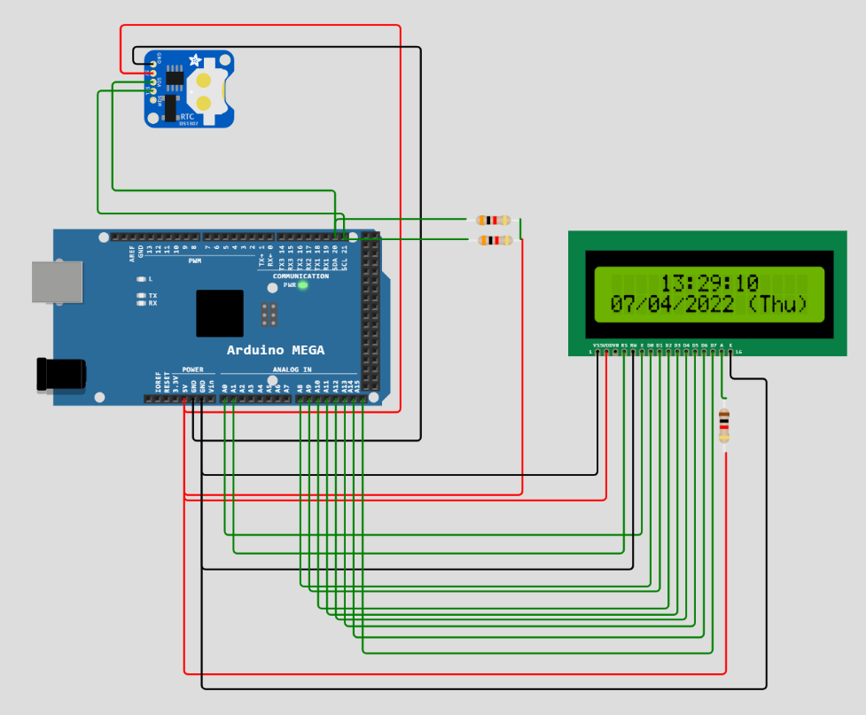
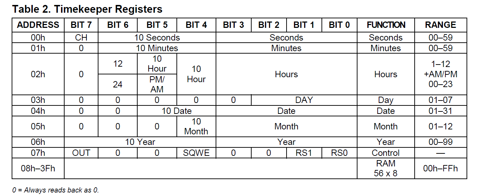

<body>

#Real Time Clock with an LCD

</img>

##Overview
####In this project we are going to retrieve the data of time and calender from the RTC and display it on the lcd, it updates data on LCD for every second.


##Components
<ul>
<li><h4>Arduino Mega(Atmega2560)</h4></li>
<li><h4>Ds1307 RTC</h4></li>
<li><h4>Three 1K Resistors</h4></li>
<li><h4>16x2 LCD</h4></li>
<li><h4>Jumper Wires</h4></li>
</ul>

##I2C Working


#### Transmission from master to slave

<strong>I2C starts with a START condition followed by a 7 or 10 bit unique address of the slave device plus one 1-bit of write bit, then master will get acknowledgement bit from the slave,then send the address of the location where you want to write the data, then master will recieve the acknowledgement from slave, then send the data, and master will recieve the acknowlegdement, as I2C auto-increments the address there is no need to send the address everytime, then to end communication, use a STOP condition. </strong>

```sequence
Master->Slave: START
Master->Slave: Slave Address + Write bit
Slave-->Master : ACK
Master->Slave: Address Location
Slave-->Master : ACK
Master->Slave: Data1
Slave-->Master : ACK
Master->Slave: Data2
Slave-->Master : ACK
Master->Slave : STOP
```

#### Receiving from Slave to Master
<strong>I2C starts with a START condition followed by a 7 or 10 bit unique address of the slave device plus 1-bit of write, then master will get acknowledgement bit from the slave,then send the address of the register where it wants to read from, then again use a start condition,followed by address of slave plus 1-bit of read,master will send an acknowlegement,then slave will send the data, master will send the acknowledgement,there is no need for the master to send acknowlegement for the last data, then end with a STOP condition.</strong>


```sequence
Master->Slave: START
Master->Slave: Slave Address + Write bit
Slave-->Master : ACK
Master->Slave: START
Master->Slave: Slave Address + Read bit
Master-->Slave: ACK
Slave->Master: Data1
Master-->Slave: ACK
Slave->Master: Data2
Master-->Slave: NOT ACK
Master->Slave: STOP
```

##Project working

<strong>Ds1307 RTC uses I2C interface to communicate with the microcontroller. Connect VCC and GND to their respective power and ground pins of arduino, connect SCL and SDA with a 1K ohm pull-up resistors.</strong>

<strong>when you power up the RTC for the first time, you need to set the data in the registers of the RTC.</strong>

#####Registers of RTC


####Setting the Register values for Time and Date 
<strong>Start the communication with START condition and send the 0xD0 as the slave address and check the I2C status registers of atmega2560 for the status of the communication, send the 0x00 which is the Address of seconds register and send the data of seconds,minutes,hours,day,date,month,year and end the communication with a STOP condition.</strong>  

```sequence
Master->Slave: START
Master->Slave: 0xD0
Slave-->Master: ACK
Master->Slave: 0x00(Seconds Address Location)
Slave-->Master: ACK
Master->Slave: Seconds data
Slave-->Master: ACK
Master->Slave: Minute data
Slave-->Master: ACK
Master->Slave: Hour data
Slave-->Master: ACK
Master->Slave: Day data
Slave-->Master: ACK
Master->Slave: Date data
Slave-->Master: ACK
Master->Slave: Month data
Slave-->Master: ACK
Master->Slave: Year data
Slave-->Master: ACK
Master->Slave: STOP
```
> For DAY DATA
1- SUNDAY , 2-MONDAY , 3-TUESDAY ......................


####Getting the Register values of Time and Date 
<strong>Start the communication with START condition and send the 0xD0 as the slave address, recieve an ACK from slave, and send 0x00 address to the slave.Again repeat the START conditon but slave address as 0xD1 (1 refers to READ bit),master sends the ACK, then slave sends the data in the "seconds" address location i.e 0x00 , master sends the acknowlegement,auto -increment moves the address location to 0x01 which is "Minutes" address location, master will send the acknowledgement, repeat the process till 0x06 i.e year address location, there is no need to send ACK from master for last data, end the communication with STOP condition.</strong>
```sequence
Master->Slave: START
Master->Slave: 0xD0
Master->Slave: 0x00 (Seconds Address Location)
Master->Slave: START
Master->Slave: 0xD1
Master-->Slave: ACK
Slave->Master:Seconds Data
Master-->Slave: ACK
Slave->Master:Minutes Data
Master-->Slave: ACK
Slave->Master:Hours Data
Master-->Slave: ACK
Slave->Master:Day Data
Master-->Slave: ACK
Slave->Master:Date Data
Master-->Slave: ACK
Slave->Master:Month Data
Master-->Slave: ACK
Slave->Master:Year Data
Master-->Slave: NO ACK
Master->Slave: STOP
```

>Setting the time and data can be done once, when RTC is powered on for the first time, there is no need to call the set function everytime.

<strong>Using the Timers we can get the data from RTC for every one second and display it on the LCD display, inside the ISR of a timer we call the function of getting data from RTC and display it on the LCD</strong>


